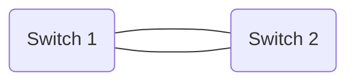
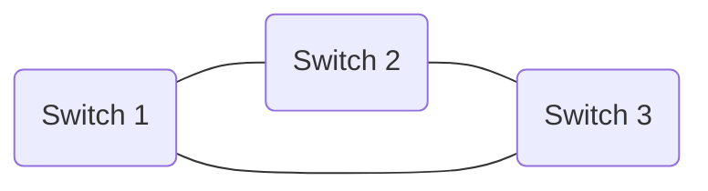
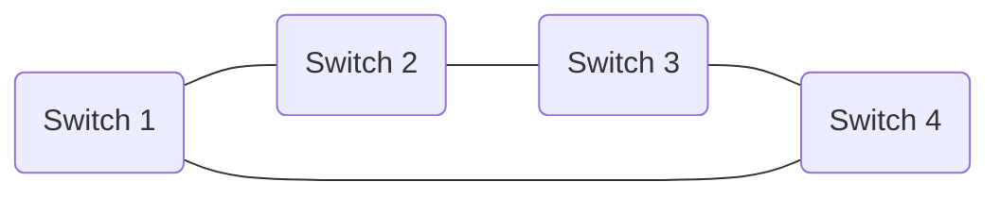
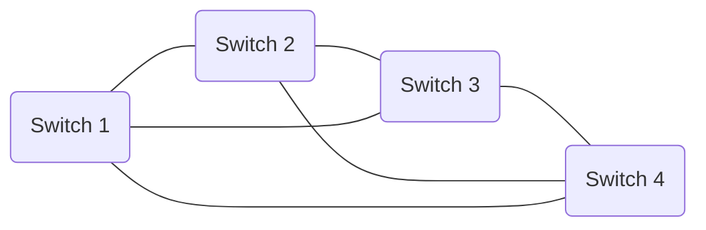
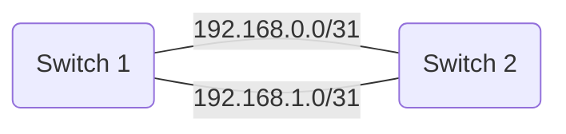
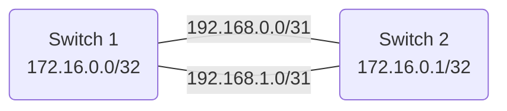

# Building Blocks

## Physical Components

You need some switches/routers with connections between them: 

Topology is arbitrary (within reason).

## Logical Components

### Link addressing

Each link between switches is configured with an IP subnet, usually /30 or /31

### Loopback addressing

Each switch is configured with a loopback IP address (or sometimes two, depending on the platform)

### Interior Gateway Protocol

The underlay IGP's function is to enable all of the switches to reach every other switch's loopback address. 

IGP options: 

- **OSPF**: easy button, works for small networks, limited control
- **IS-IS**: also easy, works well for small or large networks, better control
- **BGP**: not quite as easy, most flexible
- **Static routes**: possible for two-node networks with a single logical connection (*n* links in LAG)

### Overlay Routing Protocol — MP-BGP

